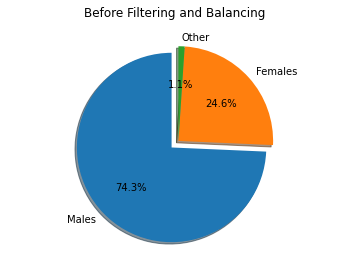
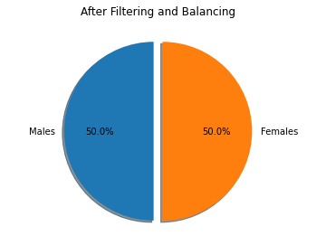
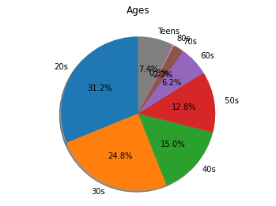
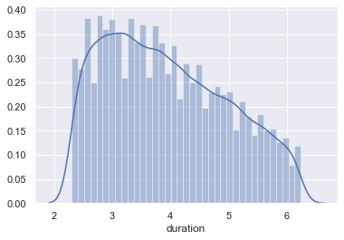

# mawdoo3-ai-task

## Summary
This repository has been created to solve the task given by mawdoo3.ai during their interview process. It contains the necessary code to pre-process data, extract audio features based on mel-spectogram and train models to classify gender based on audio features. All the of these stages were exposed with RESTFul API's using the Python web framework Flask. A Docker image is also available to run this project out of the box without the hassle of setting up your dev environment :zap:

## Data Specifications

### Resources
After investigating various speech and voice datasets on the web, the following was found to be a suitable dataset:
- Mozilla's Common Voice Dataset: https://www.kaggle.com/mozillaorg/common-voice which is based on the Mozilla Common Voice initiative https://commonvoice.mozilla.org

### Type and Size
The dataset contains validated and invalidated data, I'll use only the **valid train** data that was created for training ML models since it doesn't contain noisy or invalid data and its size is big enough with around 200,000 utterances. Each voice record is labelled with the corresponding gender, we have 10% of the dataset labelled as females, therefore we will use 10% of the male data to make the data balanced and to avoid overfitting the model to a specific gender. This makes our dataset size exactly **36,498 utterances with an average of 4.13 seconds each totalling 41 hours**, which will be enough for the machine learning model to be accurate.

## Data Extraction

- The following dataset was downloaded from Kaggle: https://www.kaggle.com/mozillaorg/common-voice/data?select=cv-valid-train, you need to update the [config](https://github.com/laithalzyoud/mawdoo3-ai-task/blob/master/config.json) with the new path for the downloaded dataset **if** you are not using Docker otherwise you have to change it from [docker-compose.yml](https://github.com/laithalzyoud/mawdoo3-ai-task/blob/master/docker-compose.yml).
- The dataset was filtered for utterances that is only gender classified as male or female
- The dataset was balanced based on the minimum # of gender occurrences to avoid bias in the trained models

API: `/filter`

## Features Extraction

- The audio files are loaded into Python using [librosa](https://github.com/librosa/librosa) load function.
- Melspectrogram features are extracted using [librosa](https://github.com/librosa/librosa) from each audio file and saved as a NumPy array in a `.npy` file, they can be found under `results/features` in the project directory after running the process.

API: `/generate`

## ML Models Training and Testing

- The first function `load_data` prepares the data to be ready as an input for the ML models,it loads all the features from the `npy` files and aggregate them into one NumPy array, also it creates a labels array that contains a boolean that specifies if the features are corresponding to a female or a male (Indicator RV). 
- The second function `split_data` splits the data into training,validating and testing sets as 0.8,0.1,0.1 of the original dataset, respctively. 
- The following neural network types are implemented in the `train` function and used as our classifiers:
1. Feed Forward - Manual | API: `/train/feedforward`
2. Random Forest | API: `/train/randomforest`
3. Decision Tree | API: `/train/decisiontree`
4. Gradient Boosting | API: `/train/gradientboosting`
5. Feed Forward - Multilayer Perceptron | API: `/train/mlp`

## Docker Instructions

To run this project using Docker follow these steps:

1. Make sure you have the latest Docker and docker-compose verisons installed
2. Pull the image: `docker pull laithalzyoud/mawdoo3-ai:latest`
3. Clone the GitHub repository: `git clone https://github.com/laithalzyoud/mawdoo3-ai-task.git`
4. Download the audio dataset and add its path to the `docker-compose.yml` file.
4. Open the terminal and go to the project path: `cd your_path_to/mawdoo3-ai-task`
5. Exectue the following command: `docker-compose up`

You can trigger the APIs from your browser or using `curl` on port 8000 with the following order:

1. localhost:8000/filter
2. localhost:8000/generate
3. localhost:8000/train/<your_classifer>

Happy dockerization!

## Exploratory Data Analysis

Some exploratory plots showing how the dataset is segmented, you can find the Jupyter notebook that was used to generate these plots here [Exploratory.ipynb](https://github.com/laithalzyoud/mawdoo3-ai-task/blob/master/Exploratory.ipynb):

1. Gender: 
   

2. Age
   

3. Duration

